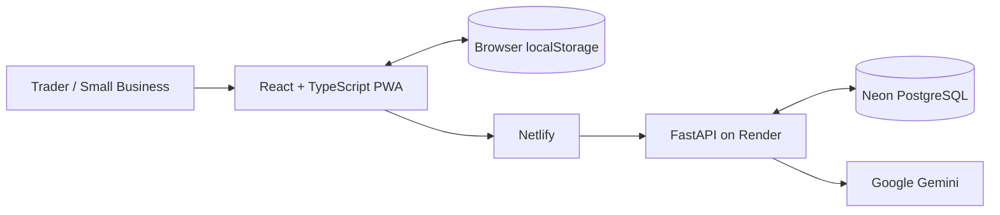

<div align="center">


# OjaFlow

### A trader-first business command centre for everyday commerce.

**Sales · Stock · Expenses · Debts · Customers · Invoices · Receipts · Business Intelligence · AI Assistance**

[](https://react.dev/)
[](https://www.typescriptlang.org/)
[](https://vite.dev/)
[](https://fastapi.tiangolo.com/)
[](https://neon.tech/)
[](https://ai.google.dev/)
[](https://www.netlify.com/)
[](https://render.com/)
[](./LICENSE)

**Nigeria-first · Mobile-first · Local-first · Multilingual · AI-assisted**

### [Launch OjaFlow](https://ojaflow.netlify.app/)

</div>

---

## Project Status

| Area | Status |
| --- | --- |
| Frontend MVP | ✅ Complete |
| FastAPI backend | ✅ Complete |
| GitHub repository | ✅ Published |
| Render backend deployment | ✅ Live |
| Neon PostgreSQL | ✅ Connected |
| Netlify frontend deployment | ✅ Live |
| Production CORS configuration | ✅ Updated for Netlify |
| Final production validation | ⏳ In progress |
| Public MVP | 🟢 Live |

**Live application:** https://ojaflow.netlify.app/  
**Repository:** https://github.com/abdulwahabbadmus001-creator/OjaFlow

---

## Why OjaFlow Exists

Many everyday traders and small businesses do not struggle because they cannot sell. They struggle because the information required to understand the business is scattered.

Sales may be remembered instead of recorded. Stock may sit in notebooks. Customer debts may be buried inside WhatsApp conversations. Expenses may be incomplete. Receipts and invoices may be created manually. At the end of the week, the business owner may still be unable to answer simple but important questions:

- How much did I sell?
- What did I spend?
- What is my estimated profit?
- Which customers owe me?
- What do I owe suppliers?
- Which products are running low?
- Which customers keep returning?
- What should I focus on next?

Traditional accounting products are powerful, but many are designed around accounting workflows rather than the daily operating reality of a small trader.

**OjaFlow is being built to close that gap.**

---

## The Product Gap

OjaFlow is not intended to become another complicated accounting suite.

Its product thesis is:

> **Give an everyday trader one calm workspace to record the business, understand the business, serve customers and make better day-to-day decisions.**

The MVP focuses on five practical gaps:

1. **Fragmented records** — sales, stock, expenses, debts and customers should not live in separate places.
2. **Complex interfaces** — traders need operational clarity without needing accounting expertise.
3. **Language accessibility** — business software should be usable beyond English-only workflows.
4. **Connectivity realities** — core records should remain available locally while cloud synchronization catches up.
5. **Disconnected AI** — business advice becomes more useful when the assistant can understand the trader's own records.

---

## Current MVP

| Capability | What OjaFlow currently does |
| --- | --- |
| Dashboard | Shows sales, expenses, estimated gross profit, debts, inventory value, customers and recent activity |
| Sales | Records transactions and reduces matching stock automatically |
| Expenses | Records operating costs and includes them in business summaries |
| Inventory | Tracks products, cost price, selling price, stock quantity and reorder levels |
| Debts & credit | Tracks customer debt, supplier obligations and repayments |
| Customer CRM | Stores customer profiles, contacts, notes, purchase context and balances |
| WhatsApp actions | Opens direct customer conversations with prepared business messages |
| Invoices | Creates multi-line invoices with due dates and payment status |
| Receipts | Generates professional sale receipts for printing or PDF saving |
| OjaChat | Combines business-record intelligence with Gemini-powered assistance |
| OjaChat controls | Copy, like and dislike interactions |
| Languages | English, Nigerian Pidgin, Yoruba, Hausa and Igbo |
| Local-first storage | Keeps per-user browser cache while syncing with the backend |
| Cloud synchronization | Synchronizes authenticated store data to the production backend/database |
| Export | JSON, CSV and business-summary export |
| Account controls | Phone + password registration/login, profile editing, password change and deletion |
| Support | In-app support ticket submission |

---

## Typical User Journey

```text
Create account
    ↓
Choose preferred language
    ↓
Complete business profile
    ↓
Add products / opening stock
    ↓
Record sales, expenses, customers and debts
    ↓
Generate invoices / receipts
    ↓
Review business performance
    ↓
Ask OjaChat about the business
    ↓
Sync / export / continue working
```

Returning users sign in with **phone number + password**.

### Current authentication model

The current MVP does not claim that the user's phone number has been verified through SMS.

The phone number currently acts as the account identifier. Stronger account recovery and possession verification — such as passkeys or a verified WhatsApp/email flow — are planned for later development.

Permanent account deletion requires:

- an authenticated session,
- the current password, and
- the exact confirmation phrase `DELETE MY ACCOUNT`.

Production sessions are currently configured for up to **60 days**, unless the user logs out earlier.

---

## Multilingual by Design

Users can choose their preferred language during account creation and change it later from Settings.

Current interface languages:

- English
- Nigerian Pidgin
- Yoruba
- Hausa
- Igbo

The chosen language is used across major operational screens and by OjaChat.

User-entered information such as customer names, product names, addresses and notes is preserved exactly as entered.

---

## OjaChat

OjaChat has two roles.

### Business intelligence

It can interpret OjaFlow records when answering questions such as:

```text
How is my business doing today?
Who owes my business money?
Which stock needs attention?
What should I focus on this week?
```

### General assistant

Broader questions are handled through the FastAPI backend using the configured Google Gemini model.

The Gemini API key remains server-side and is never exposed to the frontend.

OjaChat currently does **not** have live web search, so time-sensitive information such as current laws, exchange rates, live prices, news or government policy should be independently verified.

---

## Production Architecture



### Deployment flow

```text
User Browser
     ↓
Netlify
React / TypeScript frontend
     ↓
Same-origin /api proxy
     ↓
Render
FastAPI backend
     ├── Neon PostgreSQL
     └── Google Gemini API
```

---

## Technology Stack

| Technology | Role |
| --- | --- |
| React 19 | Frontend UI |
| TypeScript | Type-safe frontend development |
| Vite 8 | Development and production build tooling |
| Custom CSS | Responsive OjaFlow design system |
| Lucide React | Interface iconography |
| Python | Backend language |
| FastAPI | REST API, authentication and OjaChat gateway |
| SQLAlchemy 2 | ORM and persistence |
| SQLite | Local backend development |
| Neon PostgreSQL | Production cloud database |
| pwdlib / Argon2 | Password hashing |
| PyJWT | Signed authentication sessions |
| Google Gemini | OjaChat online assistant |
| Netlify | Production frontend hosting |
| Render | Production FastAPI hosting |
| GitHub | Source control and deployment source |

---

## Privacy & Security

Current controls include:

- Passwords are hashed using the recommended `pwdlib` configuration with Argon2-based hashing.
- Plaintext passwords are not stored in application records.
- Authentication uses a signed token stored in an **HttpOnly cookie**.
- State-changing authenticated requests require a matching **CSRF token**.
- Database credentials, Gemini credentials and the session secret remain backend environment variables.
- Production cookies are configured for HTTPS using `COOKIE_SECURE=true`.
- The production backend restricts allowed frontend origins to the deployed Netlify application.
- Sensitive local files such as `.env`, databases, virtual environments and build output are excluded from Git.
- Account deletion removes the user's application records and clears the related frontend cache.

### Where user/business data is stored

OjaFlow is local-first.

Profile, business and operational records may be cached in browser `localStorage` and synchronized to the authenticated backend store.

Production backend records are stored in **Neon PostgreSQL**.

The browser cache is **not separately encrypted by OjaFlow**, so security of the user's device and browser profile still matters.

When a user asks OjaChat an online question, the FastAPI backend sends the question and relevant context required for the answer to the configured Gemini API.

See [SECURITY.md](./SECURITY.md) for engineering security notes.

---

## Project Structure

```text
OjaFlow/
├── backend/
│   ├── app/
│   │   ├── routers/
│   │   ├── config.py
│   │   ├── database.py
│   │   ├── main.py
│   │   ├── models.py
│   │   ├── schemas.py
│   │   ├── security.py
│   │   └── serializers.py
│   ├── .env.example
│   └── requirements.txt
├── public/
├── src/
│   ├── components/
│   ├── config/
│   ├── lib/
│   ├── pages/
│   ├── App.tsx
│   ├── styles.css
│   └── types.ts
├── .env.example
├── netlify.toml
├── neon.ts
├── package.json
├── SECURITY.md
└── README.md
```

---

## Local Development

### Backend

```powershell
cd backend
py -m venv .venv
Set-ExecutionPolicy -Scope Process Bypass
.\.venv\Scripts\Activate.ps1
python -m pip install --upgrade pip
pip install -r requirements.txt
Copy-Item .env.example .env
uvicorn app.main:app --reload --port 8000
```

API health:

```text
http://localhost:8000/api/health
```

Interactive API documentation:

```text
http://localhost:8000/docs
```

### Frontend

Open a second terminal in the project root:

```powershell
Copy-Item .env.example .env
npm install
npm run dev
```

Frontend environment:

```env
VITE_API_BASE_URL=/api
```

---

## Build & Deployment Validation

The MVP has successfully passed:

```powershell
npm run typecheck
npm run build
```

Backend Python source compilation also completed successfully:

```powershell
cd backend
python -m compileall app
```

Production deployment status:

```text
GitHub      ✅
Render API  ✅
Neon DB     ✅
Netlify     ✅
Live URL    ✅
```

The remaining milestone is end-to-end production validation using real test data.

---

## Production Environment

### Backend

```env
APP_ENV=production
DATABASE_URL=YOUR_NEON_POSTGRESQL_URL
FRONTEND_ORIGINS=https://ojaflow.netlify.app
SESSION_SECRET=YOUR_RANDOM_SERVER_SECRET
SESSION_DAYS=60
COOKIE_SECURE=true
COOKIE_SAMESITE=lax

GEMINI_API_KEY=YOUR_SERVER_SIDE_GEMINI_KEY
GEMINI_MODEL=gemini-3.5-flash-lite
```

Sensitive values must remain in Render environment variables and must never be committed to the repository.

### Frontend

```env
VITE_API_BASE_URL=/api
```

Netlify uses:

```env
OJAFLOW_API_ORIGIN=YOUR_RENDER_BACKEND_ORIGIN
```

The repository's `netlify.toml` proxies `/api/*` from Netlify to the Render backend.

---

## Production Validation Checklist

- [ ] Create a fresh production account
- [ ] Complete business setup
- [ ] Add a product
- [ ] Record a sale
- [ ] Record an expense
- [ ] Add a customer
- [ ] Add a debt/credit record
- [ ] Create an invoice
- [ ] Generate a receipt
- [ ] Change app language
- [ ] Ask OjaChat a business-data question
- [ ] Ask OjaChat a general question
- [ ] Log out and log back in
- [ ] Confirm records remain available after login
- [ ] Confirm synchronization status
- [ ] Test export
- [ ] Test password change
- [ ] Test account deletion using a disposable test account

---

## Roadmap

### Production hardening

- Verified account recovery / stronger possession authentication
- Passkeys or verified WhatsApp/email recovery
- Rate limiting and abuse protection
- Database migrations with Alembic
- Structured logging and observability
- Tested database backup and restore procedures
- Formal retention and incident-response procedures

### Product expansion

- Purchases and supplier management
- Richer business reports and trends
- Deeper customer analytics
- Better inventory intelligence
- Optional live-information grounding for OjaChat
- Native mobile application
- Controlled pilot programme with real traders
- Monetization experiments only after product-use validation

---

## Project Documentation

OjaFlow maintains supporting documentation for users, technical review, founder records and stakeholder due diligence:

1. **OjaFlow User Guide & Service Overview**
2. **OjaFlow Privacy, Data Use & Governance Notice**
3. **OjaFlow MVP Terms of Use**
4. **OjaFlow Technical Architecture & Security Overview**
5. **OjaFlow Founder Ownership & Project Provenance Statement**
6. **OjaFlow Investor & Stakeholder Product Brief**

The ownership/provenance statement is supporting project documentation. It is not represented as a government-issued trademark, incorporation or IP-registration certificate.

---

## Founder & Project Provenance

**Founder / Developer:** Wahab Opeyemi Badmus  
**Portfolio:** https://wahabbadmus.netlify.app  
**Repository:** https://github.com/abdulwahabbadmus001-creator/OjaFlow  
**Live product:** https://ojaflow.netlify.app/

The repository commit history, source code, license and project documentation provide a dated technical record of OjaFlow's development.

Third-party packages and services remain subject to their respective licenses and terms.

User business data is not treated as founder-owned intellectual property merely because OjaFlow processes it.

---

## License

OjaFlow is currently published under the [MIT License](./LICENSE).

```text
Copyright (c) 2026 Wahab Opeyemi Badmus
```

---

<div align="center">


### Know your numbers. Understand your customers. Run your business with confidence.

**[Launch OjaFlow](https://ojaflow.netlify.app/)**

</div>
