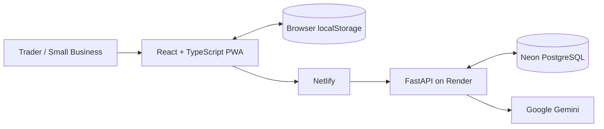

<div align="center">


# OjaFlow

### Business clarity for everyday trade.

**OjaFlow MVP v1.1**

Sales · Stock · Expenses · Debts · Customers · Invoices · Receipts · Business Intelligence · AI Assistance

[](https://ojaflow.netlify.app/)
[](https://react.dev/)
[](https://www.typescriptlang.org/)
[](https://vite.dev/)
[](https://fastapi.tiangolo.com/)
[](https://neon.tech/)
[](https://www.netlify.com/)
[](https://render.com/)
[](./LICENSE)

**Nigeria-first · Mobile-responsive · Local-first · Multilingual · AI-assisted**

### [Launch OjaFlow](https://ojaflow.netlify.app/)

</div>

---

## Overview

OjaFlow is a trader-focused business management platform designed to help small businesses understand what is happening inside the business without requiring complex accounting software.

The current public release is **OjaFlow MVP Version 1.1** — a live web application that brings together operational record keeping, customer management, inventory, credit tracking, invoices, receipts, business summaries and an AI assistant in one workspace.

**Live application:** https://ojaflow.netlify.app/  
**Repository:** https://github.com/abdulwahabbadmus001-creator/OjaFlow  
**Current release:** MVP v1.1  
**Founder / Developer:** Wahab Opeyemi Badmus

> OjaFlow v1.1 is a working MVP. It demonstrates the core product architecture and user experience, but it is not presented as the final commercial form of the platform.

---

## The Problem

Many everyday traders and small businesses generate useful business information every day, but that information is often fragmented.

A typical business may keep:

- sales in memory or notebooks,
- debts inside WhatsApp conversations,
- stock counts on paper,
- expenses without a consistent record,
- customer information across phone contacts and chats,
- invoices and receipts as manual documents.

This makes simple questions unnecessarily difficult:

- How much did I sell today?
- What did I spend?
- Which customers still owe me?
- Which products are running low?
- What is the value of my current stock?
- Which customers are returning?
- What is my estimated profit?
- What should I focus on next?

Traditional accounting products can solve parts of this problem, but many are designed around accounting workflows rather than the day-to-day reality of a small trader.

---

## The Gap OjaFlow Is Designed to Fill

OjaFlow's product thesis is straightforward:

> **Give an everyday trader one calm workspace to record the business, understand the business, serve customers and make better day-to-day decisions.**

The product is being developed around five practical gaps.

### 1. Fragmented business records

Sales, customers, expenses, stock, debts and invoices should not require separate tools.

### 2. Complex accounting-first workflows

A trader should be able to understand the business without first learning professional accounting terminology.

### 3. Language accessibility

Business software should be useful to people who are more comfortable working in Nigerian languages or Nigerian Pidgin.

### 4. Connectivity realities

The product should remain useful when connectivity is weak and synchronize records when the connection returns.

### 5. Generic AI without business context

An AI assistant becomes more useful when it can reason from the trader's own records instead of responding only as a general chatbot.

---

## What MVP v1.1 Already Delivers

| Product Area | Current MVP capability |
| --- | --- |
| Dashboard | Sales, expenses, estimated gross profit, customer debt, inventory value, customers and recent activity |
| Business trends | Weekly, monthly and yearly performance views |
| Sales | Record transactions and automatically reduce matching inventory |
| Expenses | Record operating costs and include them in business summaries |
| Inventory | Product, cost price, selling price, stock quantity and low-stock threshold management |
| Debts & credit | Track customer debt, supplier obligations and repayments |
| Customer CRM | Customer profiles, contacts, notes, purchase context and balances |
| WhatsApp actions | Open direct customer conversations from relevant workflows |
| Invoices | Create multi-line invoices with due dates and payment status |
| Receipts | Generate professional sale receipts for browser printing or PDF saving |
| OjaChat | Business-record intelligence plus Gemini-powered business/general assistance |
| OjaChat controls | Copy messages and like/dislike assistant responses |
| Languages | English, Nigerian Pidgin, Yoruba, Hausa and Igbo |
| Local-first operation | Per-user browser cache with backend synchronization |
| Cloud persistence | Authenticated synchronization to the production API/database |
| Data export | JSON, CSV and business-summary export |
| Account management | Registration, login, profile editing, password change and account deletion |
| Support | In-app support-ticket workflow |
| Themes | Light, dark and system appearance modes |

---

## Mobile-Responsive Interface

OjaFlow v1.1 is built as a responsive web application rather than a desktop-only dashboard.

The current interface includes:

- responsive layouts from desktop down to small-screen widths,
- a desktop sidebar that is replaced by a mobile navigation experience on smaller screens,
- a sticky mobile top bar,
- a fixed mobile bottom navigation,
- responsive dashboard cards and business grids,
- single-column layouts where necessary on smaller devices,
- horizontally scrollable data tables when records are wider than the screen,
- full-width mobile OjaChat,
- vertically scrollable OjaChat conversations,
- mobile-friendly bottom-sheet/modal behavior,
- responsive authentication and business-setup screens.

The CSS includes dedicated responsive breakpoints for desktop/tablet/mobile layouts, including approximately **1180px, 980px, 900px, 760px, 680px, 640px and 560px**.

> The responsive architecture is implemented in the codebase. Broader physical-device testing across different Android/iOS devices remains part of production validation and product hardening.

---

## A Typical OjaFlow Journey

```text
Create account
      ↓
Choose preferred language
      ↓
Complete business profile
      ↓
Add products / opening stock
      ↓
Record sales, expenses, customers and debts
      ↓
Generate invoices / receipts
      ↓
Review business performance
      ↓
Ask OjaChat for business insight
      ↓
Sync / export / continue working
```

---

## Multilingual by Design

Users can select a preferred language during registration and change it later from Settings.

Current interface languages:

- English
- Nigerian Pidgin
- Yoruba
- Hausa
- Igbo

The preference propagates across major operational screens and is also supplied to OjaChat.

User-entered information such as customer names, product names, business names, addresses and notes remains exactly as entered.

---

## OjaChat

OjaChat is designed as both a **business-aware assistant** and a **general assistant**.

### Business intelligence

When OjaFlow business records are available, OjaChat can answer questions such as:

```text
How is my business doing today?
What stock needs attention?
How much customer debt is outstanding?
What should I focus on next?
```

The assistant is instructed not to invent business figures that are absent from the supplied records.

### General assistance

For broader requests, the backend can use the configured Google Gemini model for general questions, writing, business ideas, customer retention, pricing, productivity and other assistance.

OjaChat currently does **not** have live web search. Time-sensitive information such as current exchange rates, laws, government policy, live prices and breaking news should be verified using an up-to-date source.

---

## Current Authentication Model

MVP v1.1 uses:

```text
Phone number + password
        ↓
Signed server session
        ↓
HttpOnly cookie
        ↓
CSRF protection for authenticated mutations
```

The current MVP does **not** claim that possession of the registered phone number is verified through SMS.

The phone number currently serves as the account identifier.

Production sessions are currently configured for up to **60 days**, unless the user logs out earlier.

Permanent account deletion requires:

- an authenticated session,
- the current account password,
- the explicit phrase `DELETE MY ACCOUNT`.

Verified recovery and stronger possession authentication are included in the next development stage.

---

## Production Architecture



### Live deployment

```text
User Browser
      ↓
Netlify
React + TypeScript frontend
      ↓
/api proxy
      ↓
Render
FastAPI backend
      ├── Neon PostgreSQL
      └── Google Gemini
```

---

## Technology Stack

| Technology | Purpose |
| --- | --- |
| React 19 | Frontend interface |
| TypeScript | Type-safe frontend development |
| Vite 8 | Development and production build tooling |
| Custom CSS | Responsive OjaFlow design system |
| Lucide React | Interface iconography |
| Python | Backend language |
| FastAPI | REST API, authentication and OjaChat gateway |
| SQLAlchemy 2 | Database ORM/persistence |
| SQLite | Local backend development |
| Neon PostgreSQL | Production database |
| pwdlib / Argon2 | Password hashing |
| PyJWT | Signed server sessions |
| Google Gemini | OjaChat online assistance |
| Netlify | Production frontend hosting |
| Render | Production backend hosting |
| GitHub | Source control and deployment source |

---

## Privacy & Security

OjaFlow v1.1 includes several concrete application-security controls:

- passwords are hashed rather than stored as plaintext,
- authentication uses an HttpOnly session cookie,
- authenticated state-changing requests require CSRF protection,
- production secrets remain in backend environment variables,
- the Gemini API key is never exposed to frontend JavaScript,
- production cookies are configured for HTTPS,
- the production frontend origin is explicitly configured on the backend,
- local secrets, databases and environment files are excluded from Git,
- account deletion removes related application records.

### Data storage

OjaFlow follows a local-first model.

Relevant profile/business/operational records may be cached inside browser `localStorage`, while authenticated store data is synchronized with the backend and production PostgreSQL database.

The browser cache is **not separately encrypted by OjaFlow**, so device and browser-profile security remain important.

When an online OjaChat request is made, the backend sends the message and relevant context required for the response to the configured Gemini service.

See [SECURITY.md](./SECURITY.md) for engineering security notes.

---

## MVP v1.1 — What This Release Proves

The current release demonstrates that the core OjaFlow concept can operate as an integrated product:

- a trader can create and manage a business workspace,
- operational records can be managed from one interface,
- records can be cached locally and synchronized to a backend,
- business records can inform AI-assisted guidance,
- multilingual workflows can coexist inside the same product,
- invoices, receipts, CRM and inventory can share the same data model,
- the application can be deployed as a full-stack web product.

This is the foundation for the full OjaFlow platform rather than the endpoint of development.

---

# Full Product Roadmap

The remaining work is organized into development workstreams rather than isolated feature additions.

## 1. Identity, Recovery & Trust

Planned:

- passkey/WebAuthn sign-in,
- verified WhatsApp or email recovery,
- trusted-device/session management,
- optional multi-factor authentication,
- stronger suspicious-login/session controls.

**Goal:** allow convenient long-lived access without relying on permanently valid credentials.

---

## 2. Purchasing & Supplier Operations

Planned:

- supplier profiles,
- purchase records,
- stock acquisition history,
- purchase orders,
- supplier balances,
- procurement insights,
- cost-price history.

**Goal:** connect the sales side of OjaFlow with the supply side of the business.

---

## 3. Advanced Inventory Intelligence

Planned:

- richer stock movement history,
- purchase-to-sale inventory flow,
- low-stock forecasting,
- inventory adjustment history,
- category-level performance,
- barcode/QR-assisted workflows where appropriate.

**Goal:** move from simple stock recording to inventory decision support.

---

## 4. Advanced Reporting & Business Intelligence

Planned:

- deeper profit/cash-flow views,
- sales comparisons and trend analysis,
- customer-value analysis,
- product performance rankings,
- configurable reporting periods,
- downloadable management reports,
- richer visual analytics.

**Goal:** help traders move from recording transactions to understanding patterns.

---

## 5. Customer Engagement

Planned:

- better customer segmentation,
- follow-up reminders,
- debt follow-up workflows,
- reusable WhatsApp communication templates,
- retention insights,
- campaign/customer-history views.

**Goal:** turn CRM records into practical relationship-management tools.

---

## 6. OjaChat Intelligence Expansion

Planned:

- richer business-context reasoning,
- proactive business alerts,
- explainable recommendations,
- optional current-information grounding,
- stronger multilingual responses,
- context-aware operational suggestions,
- safer handling of financial/legal/tax-related questions.

**Goal:** evolve OjaChat from an assistant into a useful intelligence layer across OjaFlow.

---

## 7. Notifications & Proactive Alerts

Planned:

- production-ready push notifications,
- low-stock alerts,
- debt reminders,
- daily/weekly business summaries,
- sync/problem notifications,
- configurable alert preferences.

---

## 8. Team & Multi-User Operations

Future expansion may include:

- staff accounts,
- business roles and permissions,
- activity/audit history,
- controlled access to sensitive financial information,
- multi-location or multi-branch workflows.

**Goal:** allow OjaFlow to grow with businesses that move beyond a single owner/operator.

---

## 9. Native Mobile Application

The web MVP is mobile responsive, but a future dedicated mobile application can provide:

- Android-first native/mobile experience,
- stronger offline persistence,
- device-level notifications,
- camera/barcode integrations,
- biometric/passkey authentication,
- more reliable background synchronization.

---

## 10. Production Hardening & Scale

Planned engineering work:

- database migrations with Alembic,
- rate limiting and abuse controls,
- structured observability and logging,
- tested backup and restore procedures,
- data-retention procedures,
- incident-response processes,
- automated testing/CI,
- security review,
- accessibility review,
- performance optimization,
- broader physical-device testing.

---

## Development & Partnership Opportunity

OjaFlow has moved beyond a static concept: MVP v1.1 is a live full-stack product with a functioning frontend, backend, cloud database and AI integration.

The next stage is focused on **validation, hardening and expansion**.

Potential investment, sponsorship or technical partnership could accelerate:

| Workstream | What support enables |
| --- | --- |
| Product research | Structured pilot testing with real traders and SMEs |
| Mobile development | Dedicated Android/mobile application |
| Security | Stronger authentication, recovery, audits and monitoring |
| Infrastructure | Production-grade hosting, backups and observability |
| AI development | Deeper OjaChat business intelligence and grounded assistance |
| Data & analytics | Advanced reporting, forecasting and operational insights |
| Customer operations | CRM automation, reminders and engagement tools |
| Design & accessibility | Broader device, language and accessibility testing |
| Go-to-market validation | Controlled user acquisition and measurable product-use studies |

OjaFlow is currently at the **live MVP / pre-scale validation stage**. The project does not claim product-market fit or commercial scale yet. The immediate objective is to validate the product with real users, measure which workflows create the most value, and use that evidence to guide the full product.

---

## Current Production Status

| Component | Status |
| --- | --- |
| MVP v1.1 frontend | ✅ Live |
| FastAPI backend | ✅ Live on Render |
| PostgreSQL database | ✅ Neon configured |
| Netlify deployment | ✅ Live |
| GitHub source | ✅ Published |
| Multilingual UI | ✅ Implemented |
| OjaChat | ✅ Implemented |
| Responsive architecture | ✅ Implemented |
| Local-first cache/sync | ✅ Implemented |
| End-to-end production validation | ⏳ Final testing |
| Multi-device physical testing | ⏳ Pending |
| Full commercial product | 🛠️ Roadmap |

---

## Production Validation Checklist

Before treating MVP v1.1 as fully validated:

- [ ] Create a fresh production account
- [ ] Complete business setup
- [ ] Add a product
- [ ] Record a sale
- [ ] Confirm matching stock reduces
- [ ] Record an expense
- [ ] Add a customer
- [ ] Add debt/credit
- [ ] Create an invoice
- [ ] Generate/print a receipt
- [ ] Change language and verify interface updates
- [ ] Ask OjaChat a business-data question
- [ ] Ask OjaChat a general question
- [ ] Log out and log back in
- [ ] Confirm records persist after login
- [ ] Confirm sync status
- [ ] Test data export
- [ ] Test mobile-width layout
- [ ] Test on at least one physical phone
- [ ] Test password change
- [ ] Test permanent deletion with a disposable account

---

## Project Structure

```text
OjaFlow/
├── backend/
│   ├── app/
│   │   ├── routers/
│   │   ├── config.py
│   │   ├── database.py
│   │   ├── main.py
│   │   ├── models.py
│   │   ├── schemas.py
│   │   ├── security.py
│   │   └── serializers.py
│   ├── .env.example
│   └── requirements.txt
├── public/
├── src/
│   ├── components/
│   ├── config/
│   ├── lib/
│   ├── pages/
│   ├── App.tsx
│   ├── styles.css
│   └── types.ts
├── .env.example
├── netlify.toml
├── neon.ts
├── package.json
├── SECURITY.md
└── README.md
```

---

## Local Development

### Backend

```powershell
cd backend
py -m venv .venv
Set-ExecutionPolicy -Scope Process Bypass
.\.venv\Scripts\Activate.ps1
python -m pip install --upgrade pip
pip install -r requirements.txt
Copy-Item .env.example .env
uvicorn app.main:app --reload --port 8000
```

Health endpoint:

```text
http://localhost:8000/api/health
```

API documentation:

```text
http://localhost:8000/docs
```

### Frontend

```powershell
Copy-Item .env.example .env
npm install
npm run dev
```

```env
VITE_API_BASE_URL=/api
```

---

## Build Validation

MVP v1.1 has successfully passed:

```powershell
npm run typecheck
npm run build
```

Backend source compilation also completed successfully:

```powershell
cd backend
python -m compileall app
```

---

## Production Environment

### Backend

```env
APP_ENV=production
DATABASE_URL=YOUR_NEON_POSTGRESQL_URL
FRONTEND_ORIGINS=https://ojaflow.netlify.app
SESSION_SECRET=YOUR_RANDOM_SERVER_SECRET
SESSION_DAYS=60
COOKIE_SECURE=true
COOKIE_SAMESITE=lax

GEMINI_API_KEY=YOUR_SERVER_SIDE_GEMINI_KEY
GEMINI_MODEL=gemini-3.5-flash-lite
```

Sensitive values belong in Render environment variables and must never be committed to GitHub.

### Frontend

```env
VITE_API_BASE_URL=/api
```

Netlify uses:

```env
OJAFLOW_API_ORIGIN=YOUR_RENDER_BACKEND_ORIGIN
```

The Netlify configuration proxies `/api/*` requests to the Render backend.

---

## Project Documentation

Supporting project documents have been prepared for user communication, technical review, founder records and stakeholder due diligence:

1. **OjaFlow User Guide & Service Overview**
2. **OjaFlow Privacy, Data Use & Governance Notice**
3. **OjaFlow MVP Terms of Use**
4. **OjaFlow Technical Architecture & Security Overview**
5. **OjaFlow Founder Ownership & Project Provenance Statement**
6. **OjaFlow Investor & Stakeholder Product Brief**

The ownership/provenance statement is supporting project documentation and is not represented as a government-issued trademark, incorporation or IP-registration certificate.

---

## Founder & Project Provenance

**Founder / Developer:** Wahab Opeyemi Badmus  
**Portfolio:** https://wahabbadmus.netlify.app  
**GitHub:** https://github.com/abdulwahabbadmus001-creator  
**Repository:** https://github.com/abdulwahabbadmus001-creator/OjaFlow  
**Live MVP:** https://ojaflow.netlify.app/

The repository commit history, source code, license and project documentation provide a dated technical record of OjaFlow's development.

Third-party libraries and services remain subject to their respective licenses and terms.

User business data is not treated as founder-owned intellectual property merely because OjaFlow processes it.

---

## License

OjaFlow is currently published under the [MIT License](./LICENSE).

```text
Copyright (c) 2026 Wahab Opeyemi Badmus
```

---

<div align="center">


### Know your numbers. Understand your customers. Run your business with confidence.

**MVP v1.1**

### [Launch OjaFlow](https://ojaflow.netlify.app/)

</div>
