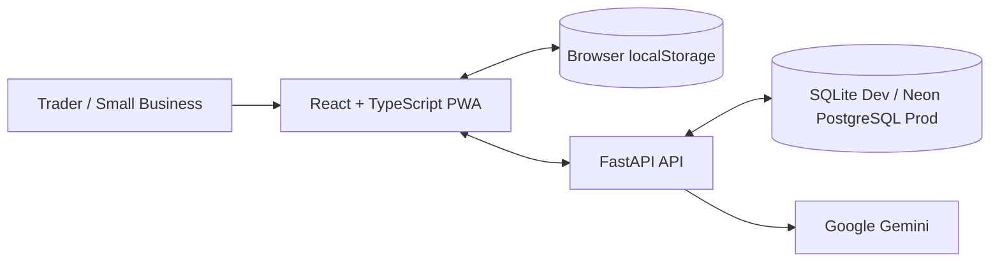

<div align="center">


# OjaFlow

### A trader-first business command centre for sales, stock, expenses, debts, customers, invoices, receipts and practical business intelligence.

[](https://react.dev/)
[](https://www.typescriptlang.org/)
[](https://vite.dev/)
[](https://fastapi.tiangolo.com/)
[](https://www.postgresql.org/)
[](https://ai.google.dev/)
[](https://www.netlify.com/)
[](./LICENSE)

**Nigeria-first · Mobile-first · Local-first · Multilingual · AI-assisted**

</div>

---

## Experience OjaFlow

### [Launch OjaFlow](https://ojaflow.netlify.app/)

The production web application is now available on Netlify. Open the link above to experience the current OjaFlow MVP.

**Live application:** https://ojaflow.netlify.app/  
**Source repository:** https://github.com/abdulwahabbadmus001-creator/OjaFlow

---

## Why OjaFlow Exists

Many everyday traders and small businesses do not fail because they cannot sell. They struggle because their business information is fragmented.

Sales may live in memory. Stock may be written in a notebook. Customer debts may sit inside WhatsApp chats. Expenses may not be recorded consistently. Receipts and invoices may be created manually. At the end of the week, the owner may still be unable to answer basic questions such as:

- How much did I actually sell?
- What did I spend?
- Which customers still owe me?
- Which products are running low?
- What is my estimated gross profit?
- Who are my repeat customers?
- What should I do next to improve the business?

Traditional accounting software can be powerful, but it is often designed around accounting workflows rather than the daily reality of a small trader.

**OjaFlow is being built to close that gap.**

---

## The Vacuum OjaFlow Aims to Fill

OjaFlow is not trying to become another complex accounting suite. Its product thesis is simpler:

> **Give an everyday trader one calm workspace to record the business, understand the business, communicate with customers and make better day-to-day decisions.**

The current product focuses on five gaps:

1. **Fragmented records** — sales, stock, debts, customers and expenses should not live in separate places.
2. **Accounting-first interfaces** — many small traders need operational clarity before they need advanced accounting terminology.
3. **Language accessibility** — the interface should be useful beyond English-only workflows.
4. **Connectivity realities** — core records should remain available locally while cloud synchronization catches up when connectivity returns.
5. **Disconnected AI** — an assistant is more useful when it can understand the trader's own OjaFlow records instead of acting only as a generic chatbot.

---

## Current MVP

| Area | Current capability |
| --- | --- |
| Dashboard | Sales, expenses, estimated gross profit, debt, inventory value, customers, recent activity and business-performance views |
| Sales | Record sales, customer/payment details and automatically reduce matching stock |
| Expenses | Record operating costs and include them in business summaries |
| Inventory | Products, cost price, selling price, stock quantity and low-stock thresholds |
| Debts & credit | Track customer debt, supplier obligations and repayments |
| Customer CRM | Customer profile, phone, address, tags/notes, purchase context and outstanding balances |
| WhatsApp actions | Open customer conversations with prepared business messages |
| Invoices | Multi-line invoices, due dates, status and browser print/PDF workflow |
| Receipts | Professional sale receipts that can be printed or saved as PDF |
| OjaChat | Local business intelligence plus Gemini-powered general/business assistance |
| OjaChat interaction | Copy user messages, copy assistant output, and like/dislike assistant responses |
| Languages | English, Nigerian Pidgin, Yoruba, Hausa and Igbo across the interface |
| Local-first behavior | Per-user browser cache plus authenticated backend synchronization |
| Export | JSON, CSV and business-summary exports |
| Account controls | Phone + password registration/login, profile/business editing, password change and permanent deletion |
| Support | In-app support-ticket workflow |

---

## A Typical OjaFlow Journey

```text
Create account
    ↓
Choose preferred language
    ↓
Complete business profile
    ↓
Add products / opening stock
    ↓
Record sales, expenses, customers and debts
    ↓
Generate invoices / receipts
    ↓
Review dashboard and business performance
    ↓
Ask OjaChat about the business or a general question
    ↓
Sync / export / continue working
```

Returning users sign in with **phone number + password**.

### Current authentication limitation

The MVP deliberately does **not** claim that a phone number has been verified by SMS. The phone number is currently an account identifier. Stronger low-cost possession verification/recovery — for example passkeys or a verified WhatsApp/email workflow — is part of the roadmap.

Permanent account deletion requires an authenticated session, the current password and the explicit phrase `DELETE MY ACCOUNT`.

---

## Multilingual by Design

Users can select their preferred language during account creation and change it later from **Settings → Language**.

Supported interface languages:

- English
- Nigerian Pidgin
- Yoruba
- Hausa
- Igbo

The selection propagates across the operational interface, including dashboard, sales, inventory, debts, settings, business setup and OjaChat. User-entered information — product names, customer names, addresses and notes — is preserved exactly as entered rather than being automatically translated.

---

## OjaChat

OjaChat is designed as two assistants in one.

### 1. Store intelligence

For questions that can be answered from saved OjaFlow records, the app can interpret the trader's own data, for example:

```text
How is my business doing today?
Who owes my business money?
What stock needs attention?
```

### 2. General and business assistant

Broader questions are sent through the FastAPI backend to the configured Gemini model. OjaChat can help with business growth, customer retention, pricing, stock planning, writing, technology, education and general questions.

The Gemini API key never lives in the browser.

OjaChat currently does **not** include live web search, so current news, laws, exchange rates, live prices and similar time-sensitive facts should be independently verified.

---

## Architecture



### Production deployment target

```text
Browser
   ↓
Netlify frontend
   ↓  /api proxy
Render FastAPI backend
   ├── Neon PostgreSQL
   └── Google Gemini API
```

---

## Technology Stack

| Technology | Role |
| --- | --- |
| React 19 | Frontend UI |
| TypeScript | Type-safe frontend development |
| Vite 8 | Development and production build tooling |
| Custom CSS | Responsive OjaFlow design system |
| Lucide React | Interface iconography |
| Python | Backend language |
| FastAPI | REST API, authentication/session layer and OjaChat gateway |
| SQLAlchemy 2 | ORM and database persistence |
| SQLite | Local development database |
| Neon PostgreSQL | Planned production database |
| pwdlib / Argon2 | Password hashing |
| PyJWT | Signed session tokens |
| Google Gemini | OjaChat online assistant |
| Netlify | Planned frontend hosting/CDN |
| Render | Planned FastAPI hosting |

---

## Privacy & Security Model

OjaFlow's current code includes several concrete controls:

- Passwords are hashed using the recommended `pwdlib` password-hashing configuration (Argon2-based); plaintext passwords are not stored in application records.
- Authentication uses a signed session token stored in an **HttpOnly cookie**.
- Authenticated mutation requests require a matching **CSRF token**.
- Backend secrets such as database credentials, session secrets and Gemini credentials stay in server environment variables.
- `.env`, local database files, virtual environments, build output and other sensitive/local artifacts are excluded from Git.
- Production is intended to use HTTPS with `COOKIE_SECURE=true` and a restricted `FRONTEND_ORIGINS` value.
- Account deletion removes the user, business profile, store state and support-ticket records in the application database and clears the local user cache in the frontend.

### Where business data currently lives

OjaFlow is local-first. Profile/business/store records are cached in browser `localStorage` and synchronized to the authenticated backend store state.

The browser cache is **not separately encrypted by OjaFlow**, so device/browser security matters. The session cookie itself is HttpOnly and is not stored in localStorage.

When a user asks OjaChat an online question, the backend sends the question plus the relevant business/context information needed to generate the response to the configured Gemini API.

See [`SECURITY.md`](./SECURITY.md) for the engineering security notes.

---

## Project Structure

```text
OjaFlow/
├── backend/
│   ├── app/
│   │   ├── routers/
│   │   ├── config.py
│   │   ├── database.py
│   │   ├── main.py
│   │   ├── models.py
│   │   ├── schemas.py
│   │   ├── security.py
│   │   └── serializers.py
│   ├── .env.example
│   └── requirements.txt
├── public/
├── src/
│   ├── components/
│   ├── config/
│   ├── lib/
│   ├── pages/
│   ├── App.tsx
│   ├── styles.css
│   └── types.ts
├── .env.example
├── netlify.toml
├── neon.ts
├── package.json
├── SECURITY.md
└── README.md
```

---

## Local Development

### Backend

```powershell
cd backend
py -m venv .venv
Set-ExecutionPolicy -Scope Process Bypass
.\.venv\Scripts\Activate.ps1
python -m pip install --upgrade pip
pip install -r requirements.txt
Copy-Item .env.example .env
uvicorn app.main:app --reload --port 8000
```

Health check: `http://localhost:8000/api/health`  
Interactive API docs: `http://localhost:8000/docs`

### Frontend

Open another terminal in the project root:

```powershell
Copy-Item .env.example .env
npm install
npm run dev
```

Frontend environment:

```env
VITE_API_BASE_URL=/api
```

---

## Build Validation

The current MVP passed the following checks on **26 September 2026**:

```powershell
npm run typecheck
npm run build
```

The Vite production build completed successfully and generated `dist/`.

Backend source compilation also completed without syntax errors:

```powershell
cd backend
python -m compileall app
```

---

## Production Configuration

### Backend environment

```env
APP_ENV=production
DATABASE_URL=YOUR_NEON_POSTGRESQL_URL
FRONTEND_ORIGINS=https://YOUR_NETLIFY_OR_CUSTOM_DOMAIN
SESSION_SECRET=GENERATE_A_LONG_RANDOM_SECRET
SESSION_DAYS=14
COOKIE_SECURE=true
COOKIE_SAMESITE=lax

GEMINI_API_KEY=YOUR_SERVER_SIDE_GEMINI_KEY
GEMINI_MODEL=gemini-3.5-flash-lite
```

Do not put database, session or Gemini secrets in frontend `VITE_` environment variables.

### Netlify

The repository's `netlify.toml` builds the Vite frontend into `dist/` and proxies `/api/*` to the production FastAPI origin using the `OJAFLOW_API_ORIGIN` environment variable.

---

## Roadmap

### Immediate — production readiness

- [x] Full-stack MVP implemented
- [x] App-wide multilingual interface
- [x] OjaChat business + general assistant
- [x] Copy / like / dislike OjaChat interaction
- [x] Local typecheck and production frontend build
- [x] Backend Python compile validation
- [x] GitHub publication
- [ ] Deploy FastAPI to Render
- [ ] Connect production Neon PostgreSQL
- [ ] Deploy frontend to Netlify
- [ ] Validate production cookies, CSRF, CORS and synchronization
- [ ] Add final live-app URL to this README

### Next product development

- Stronger low-cost authentication/recovery using passkeys or verified WhatsApp/email flows
- Purchases and supplier management
- Richer reports and business trends
- Database migrations with Alembic
- Rate limiting and abuse protection
- Structured audit logging and observability
- Backup/restore procedures and retention policy
- Optional current-information grounding for OjaChat
- Real-world pilot testing with traders before locking in monetization

---

## Project Documentation

A project documentation pack is maintained alongside the MVP for users, technical review, founder records and due diligence. It includes:

1. **OjaFlow User Guide & Service Overview**
2. **OjaFlow Privacy, Data Use & Governance Notice**
3. **OjaFlow MVP Terms of Use**
4. **OjaFlow Technical Architecture & Security Overview**
5. **OjaFlow Founder Ownership & Project Provenance Statement**
6. **OjaFlow Investor & Stakeholder Product Brief**

The ownership/provenance statement is supporting project documentation; it is not presented as a government-issued IP registration, trademark certificate or incorporation document.

---

## Founder & Project Provenance

**Founder / Developer:** Wahab Opeyemi Badmus  
**Repository:** https://github.com/abdulwahabbadmus001-creator/OjaFlow  
**Portfolio:** https://wahabbadmus.netlify.app

The repository commit history, source files, LICENSE and project documentation provide a dated technical record of the OjaFlow codebase.

Third-party libraries and services remain subject to their own licenses and terms. User business data is not treated as founder-owned intellectual property merely because OjaFlow processes it.

---

## License

This repository is currently released under the [MIT License](./LICENSE).

```text
Copyright (c) 2026 Wahab Opeyemi Badmus
```

---

<div align="center">


### Know your numbers. Understand your customers. Run your business with confidence.

</div>
